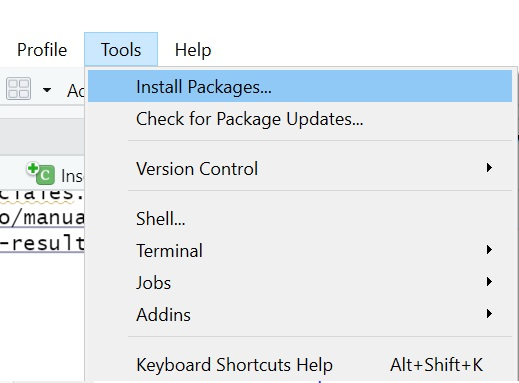
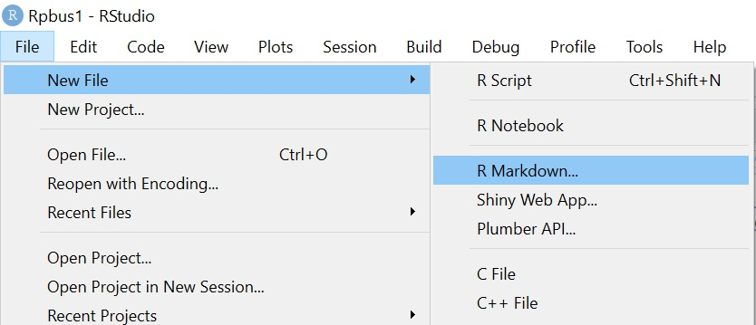
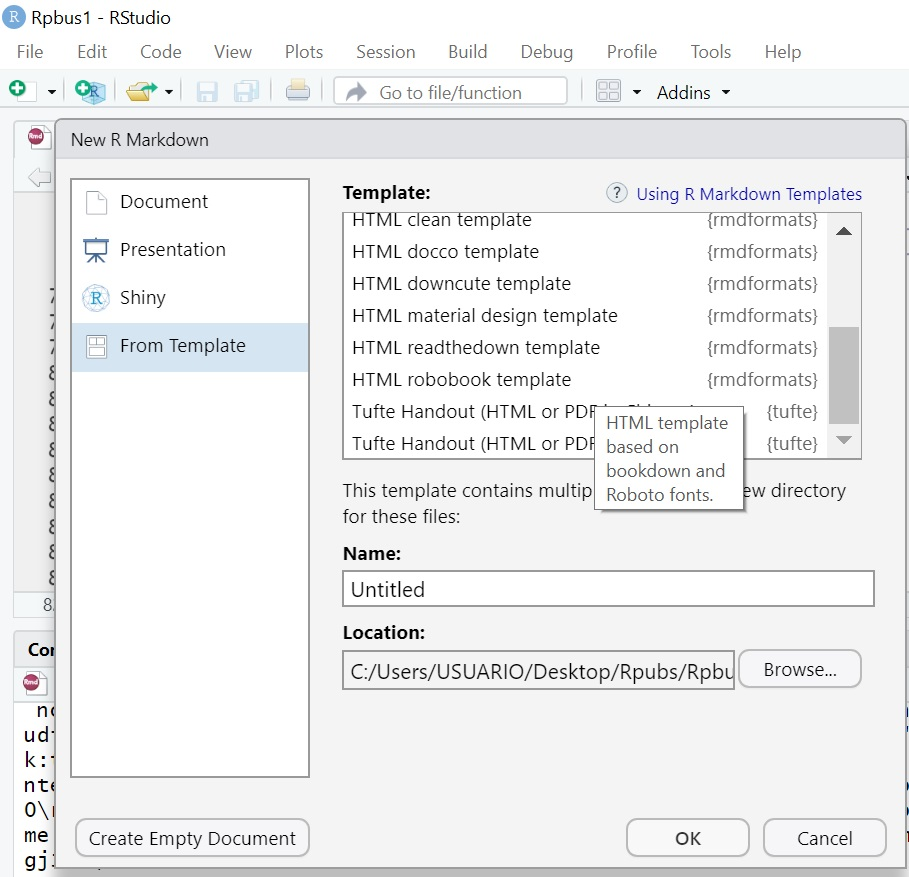

# Como crear un Rmarkdown

Se debe instalar el paquete: __knitr__. Para esto se puede tomar dos opciones:

1) Escribir el código: install.packages(knitr) en la consola
2) Acceder al menu principal, en tools y escribir el nombre del paquete



Crear un Rmarkdown es sumamente sencillo, a continuacion se muestra la forma de como hacerlo. Recordar que estamos usando el programa RStudio.


Para tener una plantilla mas personalziada, vamos acceder a la opcion __From Template__


Podemos seleccionar varias de estas opciones, la que se muestra en este archivo es: __HTML robobook template__; sin embargo, se puede seleccionar la de su preferencia.

En el caso de no tener esta opcion, es necesario descargar e instalar el paquete __rmdformats__

## Como usar adecuadamente Rmarkdown

En el archivo que estamos generando se escribe unicamente:
1) texto 
2) funciones, graficas, comando de R; es decir la programacion.

cuando vamos a programar es necesario escribir:


$```\{r\}$

 $#Aqui escribimos lo que vamos a programar$
 
$```$


## Insertar imágenes
Para insertar una imagen se debe usar: $""$

Este comando va directamente como si fuera texto (NO es una funcion de R, si no del Html).

Se recomienda crear un "proyecto" en RStudio, y tener presente que las imágenes que se van a insertar deben estar al lado del archivo "RMarkdown" que esta crando, si la imagen no está al lado la imagen no se cargará.

## Tipos de fuente
Los tipos de fuente que se usar son: el texto nomral, negrillas para resaltar alguna parte importante del informe y finalmente italic.

__negrilla__

___italic y negrilla___


## Podemos considerar listas

Unicamente escribimos: "$+\ $"

tener presente que despues del signo mas se deja un espacio

+ item 1
  + item 2
  + item 3
  
+ item 4  

Para vincular paginas web, podemos hacerlas copiando directamente el link completo desde el navegador.

Si queremos redireccionar una parte de texto con un link, poemos hacerlo asi: $[nombre](link\_ pagina)$


## Para hacer referencia Bibliografica
Unicamente usamos "Número. " y escribimos la referencia, Por ejemplo las referencias que he tomado para este articulo son:


1. Oscar Ramirez - Como publicar en Rpubs (html). [enlace](https://www.youtube.com/watch?v=m4xwKXj_y0o) 

2. Giorgio Boccardo Bosoni y Felipe Ruiz Bruzzone - RStudio para Estadística Descriptiva en Ciencias Sociales. [enlace](https://bookdown.org/gboccardo/manual-ED-UCH/introduccion-al-uso-de-rmarkdown-para-la-compilacion-de-resultados-de-rstudio-en-diferentes-formatos.html)

## Resaltar
Para resaltar un parafo importante usamos el simbolo mayor que 

> Vamos a resaltar
> este párrafo

## Insertar cuadros

Título 1 | Título 2
-------- | ---------
dato | dato
dato | dato

# Cómo hacer una publicacion en RPubs 
Una vez terminado el informe podemos vincularlo en RPubs, lo que vamos hacer es poner en "publicar" escribimos nuestra cuenta de correo donde tengamos la cuenta de RPubs y listo.


